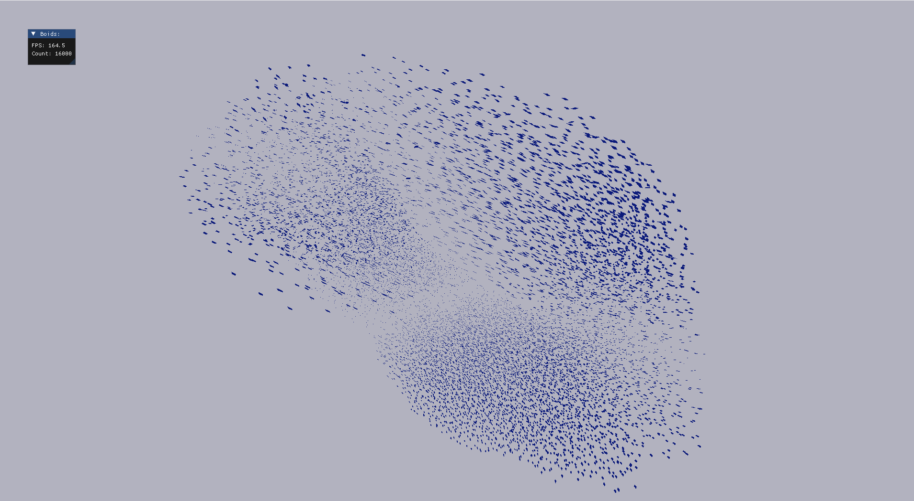
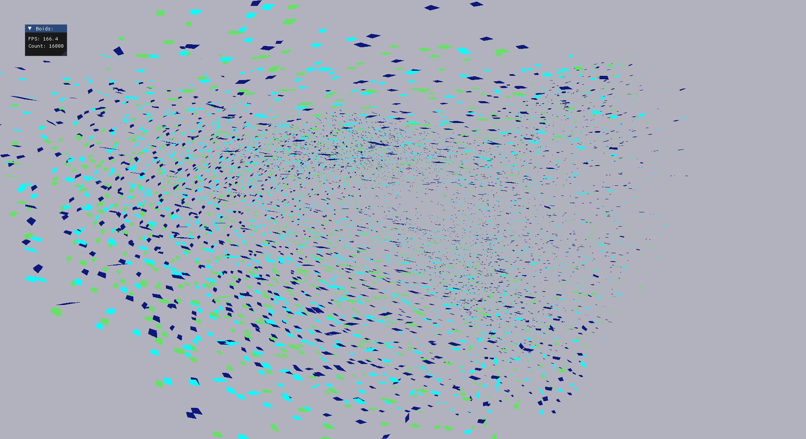

# build and run on windows
```
build.bat
boids.exe
```
# you can
- move around using WASD
- look around using mouse

# screenshots




# why i made this
- to learn about geometry shaders and compute shaders